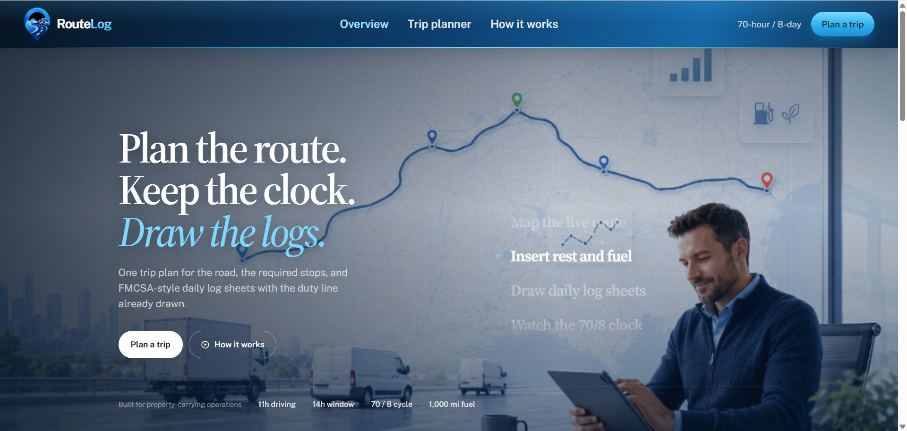
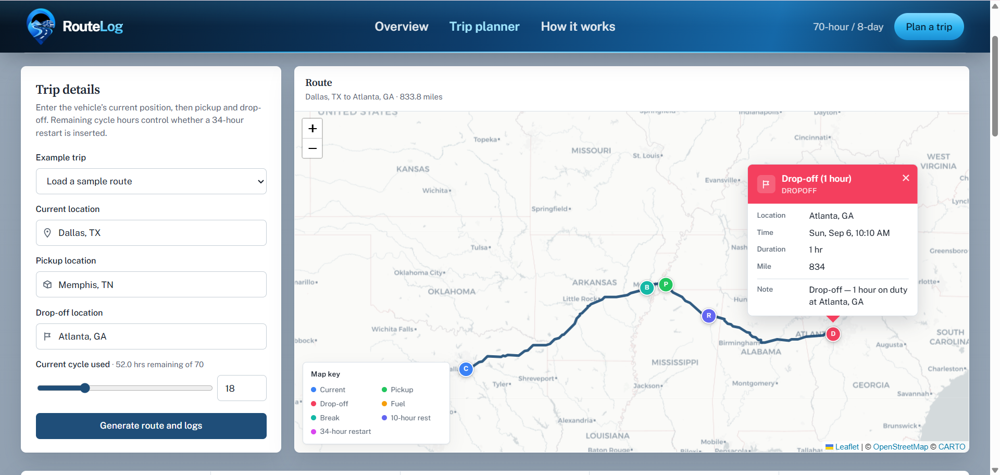
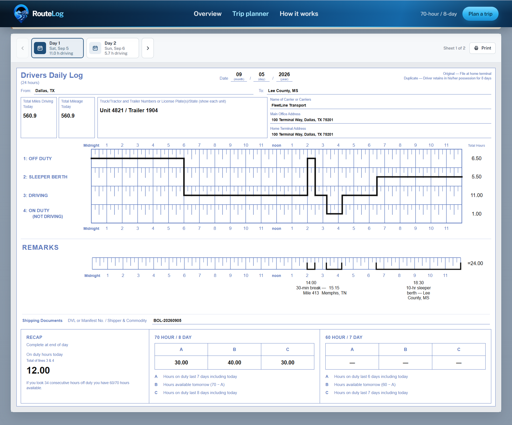

# RouteLog

Hours-of-service trip planner for property-carrying drivers. Enter current location, pickup, drop-off, and cycle hours already used. RouteLog returns a mapped itinerary with required rest and fuel stops, plus FMCSA-style daily log sheets with the duty line already drawn.

This is a planning tool, not a certified electronic logging device.







## What it does

1. Geocodes current, pickup, and drop-off locations with **OpenStreetMap Nominatim**
2. Builds driving directions with **OSRM**
3. Simulates the trip under FMCSA hours of service:
   - 11-hour driving limit
   - 14-hour on-duty window
   - 30-minute break after 8 hours of driving
   - 10 consecutive hours off duty / sleeper berth
   - 70 hours in 8 days, with a 34-hour restart when the cycle is exhausted
   - 1 hour on duty at pickup and at drop-off
   - 30-minute fuel stop at least every 1,000 miles
4. Splits the timeline onto paper-style daily logs. Status totals always add up to 24 hours.

The shift starts at **06:00** after 10 hours off duty. The adverse-driving exception is not applied.

## Local setup

Python 3.11+ and Node 18+.

### Backend

```bash
cd backend
python -m venv .venv
.venv\Scripts\activate          # macOS/Linux: source .venv/bin/activate
pip install -r requirements.txt
python manage.py runserver 8000
```

### Frontend

```bash
cd frontend
npm install
npm run dev
```

Open [http://localhost:5173](http://localhost:5173). Vite proxies `/api` to Django on port 8000.

## Tests

```bash
cd backend
python manage.py test trips
```

## Project layout

```
assessment/
  frontend/                 React + Vite UI
    src/components/         Map, itinerary, daily log sheets
  backend/                  Django API
    config/                 Settings, URLs, WSGI
    trips/                  Plan API, HOS engine, log builder
      services/hos.py       Hours-of-service simulator
      services/geo.py       Geocoding and routing
      services/logs.py      Daily log sheets
    manage.py
    requirements.txt
  docs/                     Product screenshots
```
